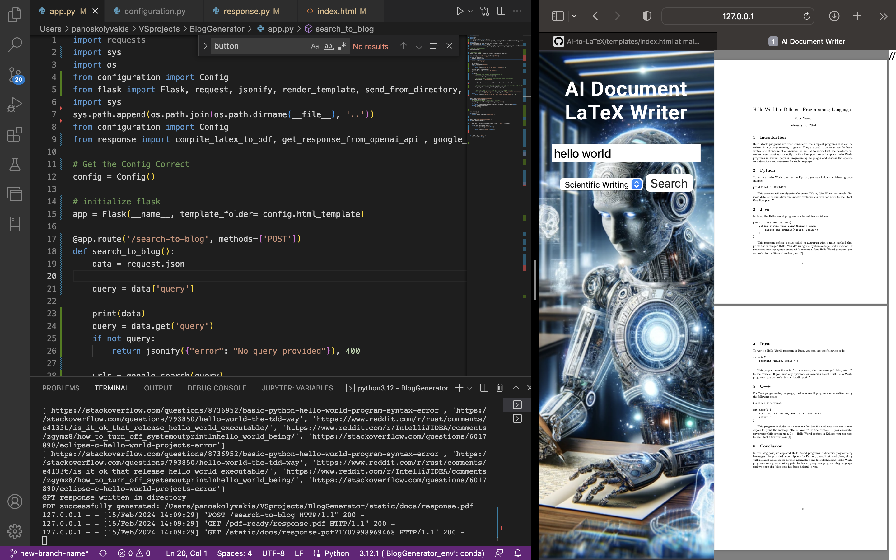

<!-- Headings: To create a heading, use the # symbol before your heading text. Use multiple ## for subheadings.
Bold: To bold text, wrap it with two asterisks or underscores. For example, **bold text**.
Italic: To italicize text, wrap it with one asterisk or underscore. For example, *italic text*.
Links: To create a link, wrap the link text in brackets [ ], followed by the URL in parentheses ( ). For example, [OpenAI](https://openai.com).
Images: To add an image, use the syntax .
Lists: For unordered lists, use asterisks, plus signs, or hyphens. For ordered lists, use numbers. -->


# Flask Blog and PDF Generator

This project is a Flask-based web application that utilizes Google Custom Search and OpenAI's GPT to generate blog posts based on user queries. It then formats these posts into LaTeX and compiles them into PDFs for download. This README outlines how to set up and run the project locally.

You can find my BLOG on this project [here](https://panoskolyvakis.github.io/blog.html)
The user can now do consecutive calls to the GPT API to improve the document according to preferences (e.g. you can click refine button to add/remove paragraphs, or customize the document in general)

I have recently added a .tex editor that can be used to recompile the document to the webUI. The editor may be used to edit the document manually and recompile. 


*Once the project is completed, I plan to deploy it on the web, possibly using Heroku or AWS.

## Features

- Google Custom Search to fetch relevant URLs based on user queries.
- OpenAI's GPT integration for generating rich, relevant content for blog posts.
- LaTeX for formatting and compiling blog posts into downloadable PDF documents.
- A simple, user-friendly web interface for submitting queries and downloading blog posts as PDFs.

## Prerequisites

Before you begin, ensure you have met the following requirements:

- Python 3.6 or later installed on your machine.
- Flask installed in your Python environment.
- Access to OpenAI's API and a valid API key.
- A Google Custom Search Engine set up with an API key and Search Engine ID.
- LaTeX installed on your system for PDF generation.

## Installation

To install the project dependencies, run the following command in your virtual environment:

```bash
pip install -r requirements.txt

```

## Configuration

http://localhost:5000


NOTE: 
to initialize the prohect you need to add a configuration.py file with the following script:
```
class Config:
    def __init__(self):
        self.response_path = 'static/docs/response.tex'
        self.openapi_key = 'fromAPIkey'
        self.google_API_KEY = 'fromGoogleCustomSearchEnginges'
        self.google_CSE_ID = 'fromGoogleCustomSearchEnginges'
        self.DEBUG_URL = 'https://en.wikipedia.org/wiki/Cattle'
        self.html_template= 'templates'
        self.tex_file = 'static/docs/response.tex'

```
alternatively you can add variables to your path

## To install all LaTeX tlmgr packages if a template doesnt compile
Ensure that the .sh script is executable

```bash
chmod +x install_latex_packages.sh
```

Run the script to install all .tex-required packages NOTE: you probably need to run sudo 

```bash
sudo ./install_latex_packages.sh

```